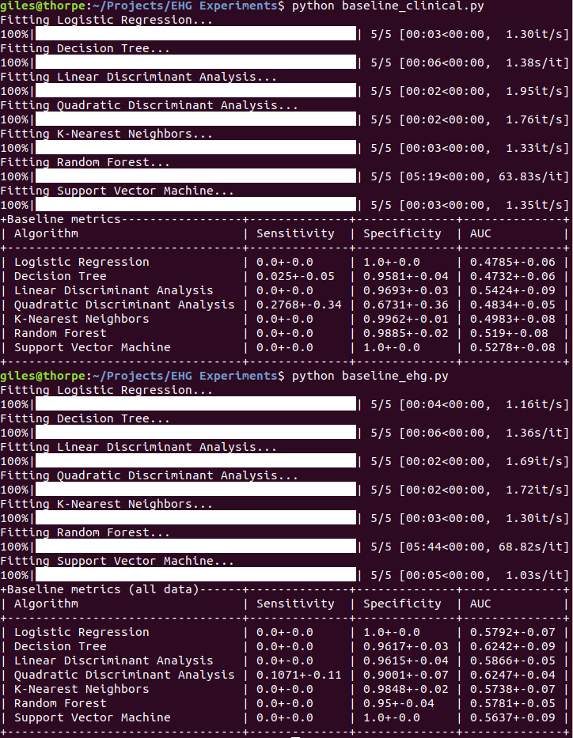
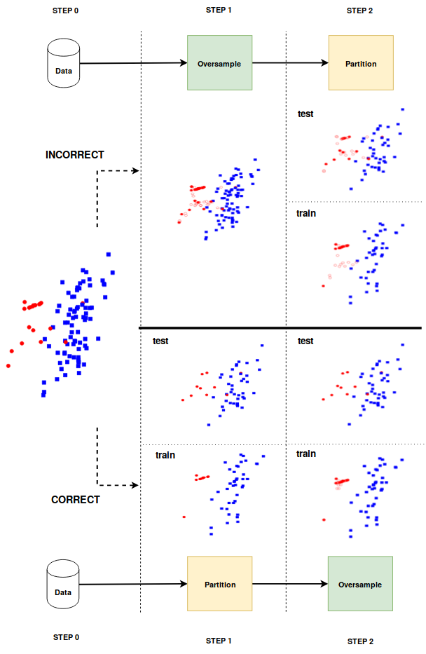
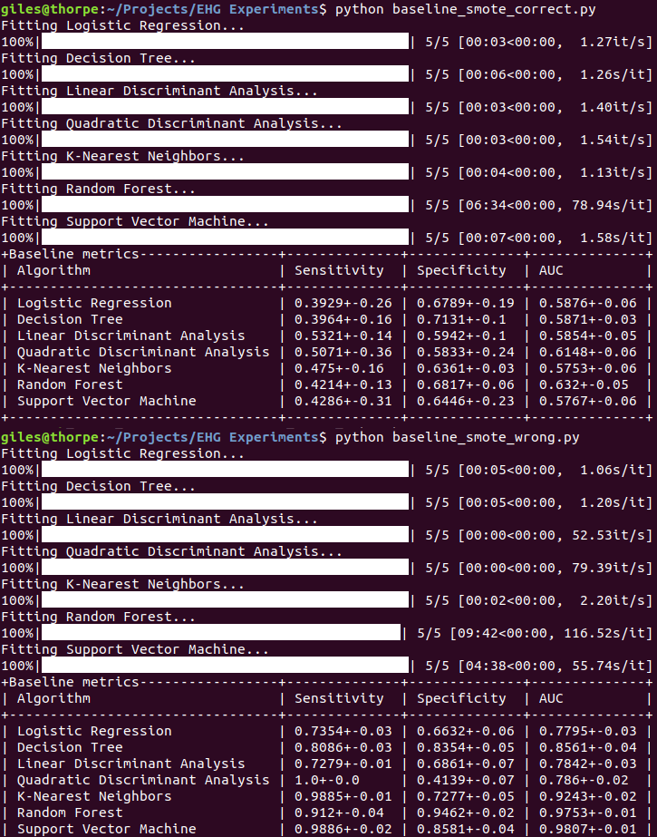

# Experiments on the [TPEHGDB](https://www.physionet.org/physiobank/database/tpehgdb/) dataset

## The impact of features extracted from raw EHG signals

To compare the predictive performances of the model constructed using solely clinical variables and the model where the data is augmented with four features, extracted from the EHG signal, run `python baseline_clinical.py` and `python baseline_ehg.py`:

## Oversampling on an artificial dataset

To generate the different scatter plots, used for Figure 1 (see below), run `python oversampling.py`

## Oversampling the TPEHGDB dataset incorrectly vs correctly

To compare oversampling in a correct fashion vs oversampling in an incorrect fashion, run `python baseline_smote_correct.py` and `python baseline_smote_incorrect.py`:

## Questions, citing and contact

A citation will be posted here as soon as this is available. In case there are any problems with running the code, or any questions, please create an issue or contact me at gilles(dot)vandewiele(at)ugent(dot)be 
